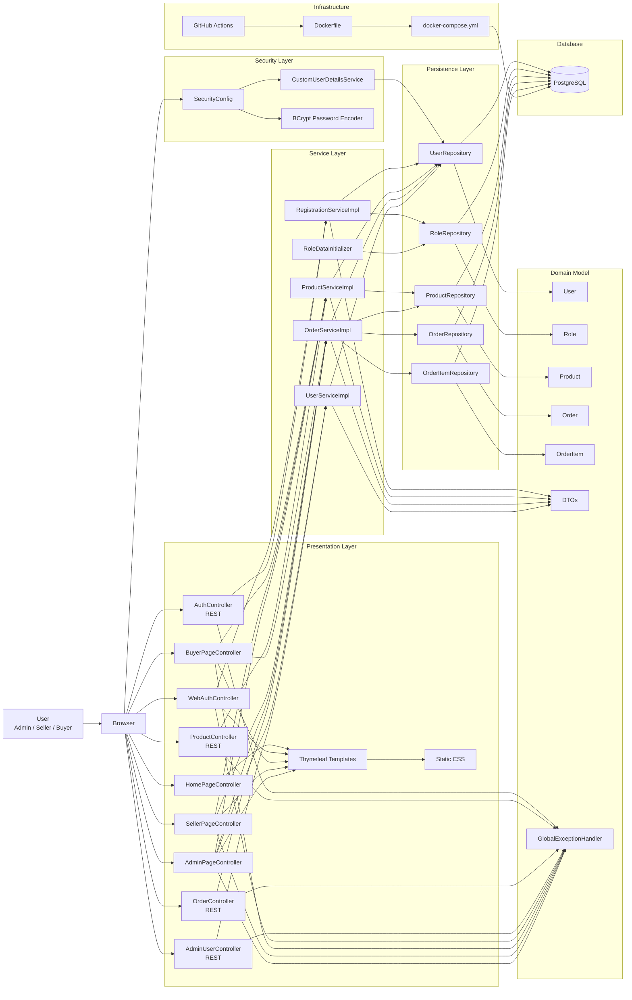
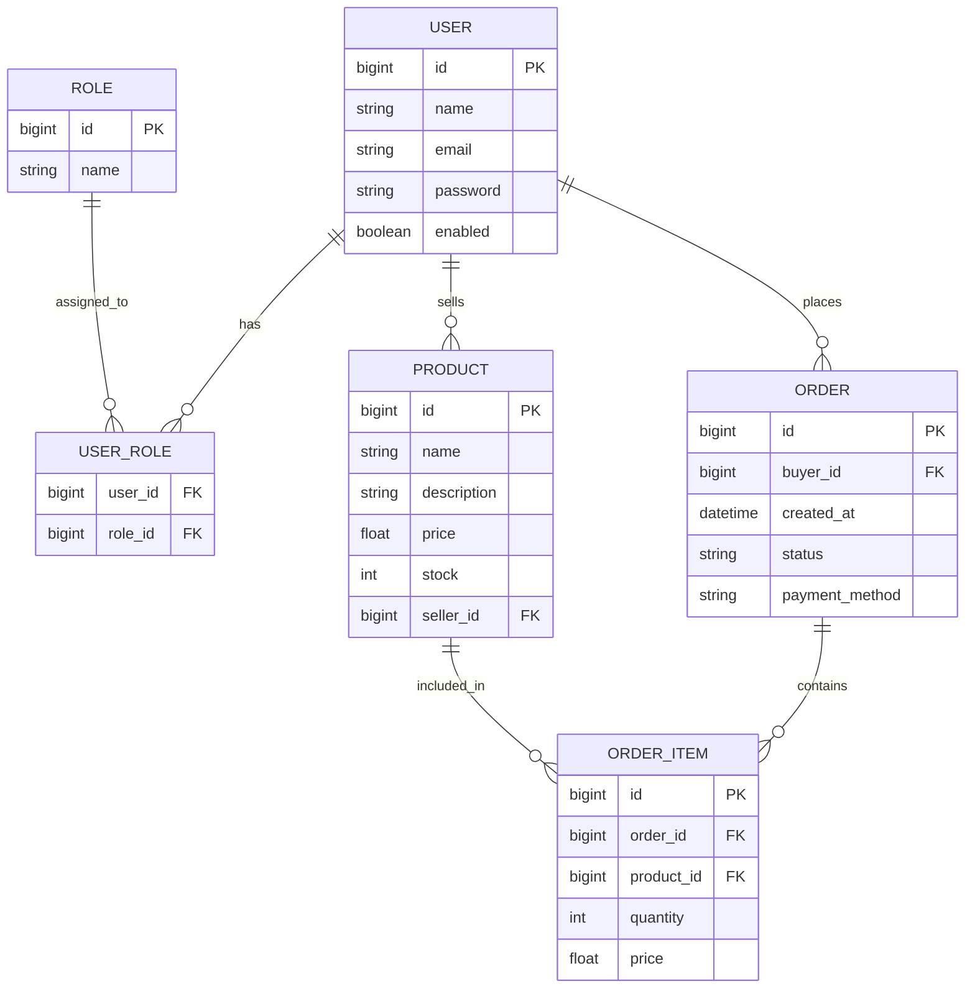

# Marketplace

A full-stack Spring Boot web application for a small marketplace system with role-based access control, REST APIs, Thymeleaf pages, PostgreSQL persistence, Docker support, and automated test execution through GitHub Actions.

This project was developed for the CSE 3220 Software Engineering Lab and is centered around three roles:

- `ADMIN`
- `SELLER`
- `BUYER`

## Project Status

- Repository: `https://github.com/apusharma45/marketplace`
- CI: GitHub Actions is configured to build and run tests on pushes and pull requests
- Docker: `Dockerfile` and `docker-compose.yml` are included
- Deployment: a deployed version exists, but no public URL is documented in this repository at the moment

## Deployed Version Admin Account

The deployed version includes a built-in admin account:

- Name: `Apu Sharma`
- Email: `admin@marketplace.live`

If you want to log in to the deployed admin account, use the email above. The password is not documented in this repository.

## Table of Contents

- [Features](#features)
- [Architecture](#architecture)
- [ER Diagram](#er-diagram)
- [Tech Stack](#tech-stack)
- [Implemented Pages and Workflows](#implemented-pages-and-workflows)
- [API Endpoints](#api-endpoints)
- [Getting Started](#getting-started)
- [Running Tests](#running-tests)
- [CI/CD Pipeline](#cicd-pipeline)
- [Project Structure](#project-structure)
- [Contributors](#contributors)

## Features

### Role-Based Access Control

- `ADMIN` can access the admin dashboard, view all users, view all products, view all orders, enable or disable users, update order status, and remove products from the admin panel.
- `SELLER` can access the seller dashboard, create products, edit products, delete products, view seller-related orders, and mark orders as shipped.
- `BUYER` can access the buyer dashboard, browse products, view product details, manage a session-based cart, place orders, and view buyer order history.

### Authentication and Security

- Spring Security with form-based login
- HTTP Basic enabled for secured API testing and API access
- BCrypt password encryption
- Role-based URL protection for admin, seller, buyer, and API routes
- Custom `UserDetailsService` that supports login by username or email
- Automatic role seeding on startup for `ROLE_ADMIN`, `ROLE_SELLER`, and `ROLE_BUYER`

### Marketplace Features

- Public registration for buyers and sellers
- Product listing for authenticated users
- Seller-side product CRUD through both web pages and REST endpoints
- Buyer-side cart management using HTTP session
- Single-product ordering and cart checkout
- Order status handling with `PENDING`, `PAID`, `SHIPPED`, and `CANCELLED`
- Payment method support for `COD` and `CARD`
- Admin management pages for users, products, and orders

### API and Validation

- REST endpoints for authentication, products, orders, and admin user listing
- DTO-based request and response handling
- Bean validation on request DTOs
- Global exception handling for validation and runtime errors

### Quality and Tooling

- Layered architecture: controller, service, repository, entity, DTO, security, exception
- PostgreSQL for the main application database
- H2 for test execution
- 48 automated tests covering service logic, repositories, controller behavior, security flows, and workflow scenarios
- Dockerized application and database setup
- GitHub Actions workflow for automated test runs

## Architecture

The application follows a layered Spring Boot architecture. Users interact with Thymeleaf pages and REST endpoints. Controllers delegate to services, services coordinate business logic and validation, repositories persist data through Spring Data JPA, and PostgreSQL stores the application data.



## ER Diagram

The project uses the following main tables: `users`, `roles`, `user_roles`, `products`, `orders`, and `order_items`.



### Relationship Summary

- `USER <-> ROLE`: many-to-many through `user_roles`
- `USER -> PRODUCT`: one-to-many through seller ownership
- `USER -> ORDER`: one-to-many through buyer ownership
- `ORDER -> ORDER_ITEM`: one-to-many
- `PRODUCT -> ORDER_ITEM`: one-to-many

## Tech Stack

| Layer | Technology |
| --- | --- |
| Backend | Spring Boot 4.0.3 |
| Language | Java 17 |
| Frontend | Thymeleaf, HTML, CSS |
| Security | Spring Security, BCrypt |
| Database | PostgreSQL |
| ORM | Spring Data JPA / Hibernate |
| Validation | Jakarta Validation |
| Build Tool | Maven, Maven Wrapper |
| Testing | JUnit 5, Mockito, Spring Boot Test, MockMvc, H2 |
| Containerization | Docker, Docker Compose |
| CI | GitHub Actions |

## Implemented Pages and Workflows

### Public Pages

- Home page
- Login page
- Registration page

### Buyer Pages

- Buyer dashboard
- Product browsing page
- Product details page
- Cart page
- Create order page
- Buyer order history page

### Seller Pages

- Seller dashboard
- Seller product list
- Seller create product page
- Seller edit product page
- Seller orders page

### Admin Pages

- Admin dashboard
- Admin users page
- Admin products page
- Admin orders page

### Business Workflows

- Register as buyer or seller
- Log in and get redirected to a role-specific dashboard
- Browse products as a buyer
- Add products to cart
- Change item quantities in cart
- Checkout cart
- Place a single-product order directly
- Create, update, and delete products as a seller
- Ship seller orders
- View all users, products, and orders as an admin
- Enable or disable users as an admin
- Update order status as an admin

## API Endpoints

### Authentication

| Method | Endpoint | Access | Description |
| --- | --- | --- | --- |
| POST | `/api/auth/register` | Public | Register a new buyer or seller |

### Product API

| Method | Endpoint | Access | Description |
| --- | --- | --- | --- |
| GET | `/api/products` | Authenticated | List all available products |
| GET | `/api/products/{productId}` | Authenticated | Get a single available product |
| GET | `/api/sellers/{sellerId}/products` | Seller | List products for a seller |
| POST | `/api/sellers/{sellerId}/products` | Seller | Create a product for a seller |
| GET | `/api/sellers/{sellerId}/products/{productId}` | Seller | Get a seller-owned product |
| PUT | `/api/sellers/{sellerId}/products/{productId}` | Seller | Update a seller-owned product |
| DELETE | `/api/sellers/{sellerId}/products/{productId}` | Seller | Delete a seller-owned product |
| GET | `/api/admin/products` | Admin | List all products for admin review |

### Order API

| Method | Endpoint | Access | Description |
| --- | --- | --- | --- |
| POST | `/api/buyers/{buyerId}/orders` | Buyer | Place an order |
| GET | `/api/buyers/{buyerId}/orders` | Buyer | List buyer orders |
| GET | `/api/sellers/{sellerId}/orders` | Seller | List seller-related orders |
| GET | `/api/admin/orders` | Admin | List all orders |

### User API

| Method | Endpoint | Access | Description |
| --- | --- | --- | --- |
| GET | `/api/admin/users` | Admin | List all users |

### Main Web Routes

| Route | Access | Description |
| --- | --- | --- |
| `/` | Public | Home page |
| `/login` | Public | Login page |
| `/register` | Public | Registration page |
| `/dashboard` | Authenticated | Redirects to role-specific dashboard |
| `/buyer` | Buyer | Buyer dashboard |
| `/buyer/products` | Buyer | Product listing |
| `/buyer/products/{id}` | Buyer | Product detail page |
| `/buyer/cart` | Buyer | Cart page |
| `/buyer/orders` | Buyer | Buyer orders |
| `/buyer/orders/create/{productId}` | Buyer | Direct order form |
| `/seller` | Seller | Seller dashboard |
| `/seller/products` | Seller | Seller products |
| `/seller/products/create` | Seller | Create product page |
| `/seller/products/{id}/edit` | Seller | Edit product page |
| `/seller/orders` | Seller | Seller orders |
| `/admin` | Admin | Admin dashboard |
| `/admin/users` | Admin | Admin user management |
| `/admin/products` | Admin | Admin product management |
| `/admin/orders` | Admin | Admin order management |

### Buyer Web Actions

| Method | Route | Access | Description |
| --- | --- | --- | --- |
| POST | `/buyer/cart/add` | Buyer | Add a product to the cart |
| POST | `/buyer/cart/remove/{productId}` | Buyer | Remove a product from the cart |
| POST | `/buyer/cart/increment/{productId}` | Buyer | Increase cart quantity |
| POST | `/buyer/cart/decrement/{productId}` | Buyer | Decrease cart quantity |
| POST | `/buyer/cart/checkout` | Buyer | Checkout the current cart |
| POST | `/buyer/orders/create` | Buyer | Place a direct order from the order form |

### Seller Web Actions

| Method | Route | Access | Description |
| --- | --- | --- | --- |
| POST | `/seller/products/create` | Seller | Create a product from the seller UI |
| POST | `/seller/products/{id}/edit` | Seller | Update a seller product |
| POST | `/seller/products/{id}/delete` | Seller | Delete a seller product |
| POST | `/seller/orders/{orderId}/ship` | Seller | Mark an order as shipped |

### Admin Web Actions

| Method | Route | Access | Description |
| --- | --- | --- | --- |
| POST | `/admin/users/{userId}/status` | Admin | Enable or disable a user |
| POST | `/admin/products/{productId}/delete` | Admin | Delete a product from the admin panel |
| POST | `/admin/orders/{orderId}/status` | Admin | Update order status |

## Getting Started

### Prerequisites

- Java 17 or newer
- Maven 3.9+ or the included Maven Wrapper
- PostgreSQL
- Docker and Docker Compose for containerized setup

### Configuration

The application expects the following environment variables:

#### Spring Boot app

- `SPRING_DATASOURCE_URL`
- `SPRING_DATASOURCE_USERNAME`
- `SPRING_DATASOURCE_PASSWORD`
- `PORT` (optional, defaults to `8080`)

#### Docker Compose

- `POSTGRES_DB`
- `POSTGRES_USER`
- `POSTGRES_PASSWORD`

### Option 1: Run with Docker Compose

PowerShell:

```powershell
$env:POSTGRES_DB="marketplace"
$env:POSTGRES_USER="postgres"
$env:POSTGRES_PASSWORD="your_strong_password"
docker compose up --build
```

Access the application at:

- `http://localhost:8080`

The PostgreSQL container is exposed at:

- `localhost:5433`

Stop the stack with:

```powershell
docker compose down
```

### Option 2: Run Locally

1. Start a PostgreSQL instance.
2. Set the datasource environment variables.

PowerShell:

```powershell
$env:SPRING_DATASOURCE_URL="jdbc:postgresql://localhost:5432/marketplace"
$env:SPRING_DATASOURCE_USERNAME="postgres"
$env:SPRING_DATASOURCE_PASSWORD="your_strong_password"
$env:PORT="8080"
```

3. Run the application:

```powershell
.\mvnw.cmd spring-boot:run
```

4. Open:

- `http://localhost:8080`

### Account Setup Notes

- Roles are seeded automatically at startup.
- Public registration supports `ROLE_BUYER` and `ROLE_SELLER`.
- Public registration does not create admin users.
- To use admin screens, an admin user must already exist in the database and be associated with `ROLE_ADMIN`.
- The deployed version includes a built-in admin user with email `admin@marketplace.live`.

## Running Tests

The project currently contains 48 automated tests across service, controller, repository, integration, security, and workflow scenarios.

### Run all tests

PowerShell:

```powershell
.\mvnw.cmd clean test
```

Or:

```powershell
mvn -B clean test
```

### Test Coverage Includes

- Service unit tests with Mockito
- Repository tests with `@DataJpaTest`
- Controller tests
- Integration tests with `@SpringBootTest`
- Security flow tests using `MockMvc`
- End-to-end style workflow tests

### Test Database

Tests use an H2 in-memory database configured in `src/test/resources/application-test.properties`.

## CI/CD Pipeline

### GitHub Actions

The repository includes a GitHub Actions workflow at `.github/workflows/ci.yml`.

Current CI behavior:

- runs on pushes to all branches
- runs on pull requests for all branches
- sets up Java 17
- runs `mvn -B clean test`

### Deployment Note

The course guideline mentions automatic deployment to Render, but a Render deployment step is not currently present in this repository's workflow file. The repository currently documents CI testing, Dockerization, and local execution.

## Project Structure

```text
marketplace/
|-- .github/
|   `-- workflows/
|       `-- ci.yml
|-- .mvn/
|-- src/
|   |-- main/
|   |   |-- java/com/software/marketplace/
|   |   |   |-- config/
|   |   |   |-- controller/
|   |   |   |-- dto/
|   |   |   |-- entity/
|   |   |   |-- exception/
|   |   |   |-- repository/
|   |   |   |-- security/
|   |   |   `-- service/
|   |   `-- resources/
|   |       |-- static/
|   |       |-- templates/
|   |       `-- application.properties
|   `-- test/
|       |-- java/com/software/marketplace/
|       `-- resources/application-test.properties
|-- Dockerfile
|-- docker-compose.yml
|-- mvnw
|-- mvnw.cmd
|-- pom.xml
`-- README.md
```

## Contributors

- `apusharma45`
- `Arfanjaman`

## Academic Note

This project was developed for the CSE 3220 Software Engineering Lab as a full-stack web application and DevOps workflow exercise.
